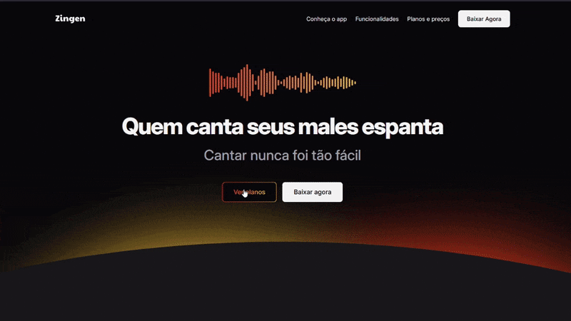

# 🎤 Projeto Zingen 🎤
Desafio prático desenvolvido durante Formação Full-Stack promovida pela Rocketseat
___
## 🌐 Layout direcionado para Landing Page de aplicativo
  

  
___
### 🤖 Tecnologias e Recursos  
  
* HTML
* CSS
* Git
* Figma
* Notion  
* Responsively App

#### 🔎 Você pode conferir o resultado clicando [aqui](https://arturtinoco.github.io/zingen/) ou ver o projeto no [Figma](https://www.figma.com/community/file/1371886246180677672) feito por [Ilana Mallak](https://www.linkedin.com/in/ilanamallak/). 
